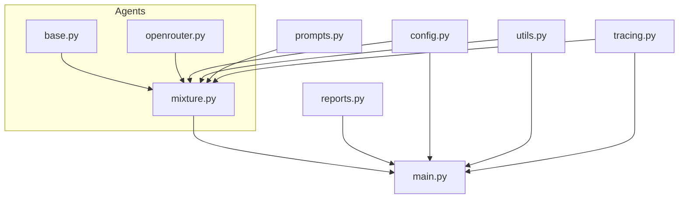

# Modularization and Tracing Refactor Plan for `deepoutputs_engine.py`

## 1. Overview

This document outlines a refactor and modularization plan for `deepoutputs_engine.py` to improve maintainability, extensibility, and traceability. It also details the design and integration of a comprehensive tracing feature for all API calls and responses, with a structured output for both human and LLM review.

---

## 2. Modularization Structure

```
deepoutputs_engine/
├── __init__.py
├── config.py                # Configuration, env loading, constants
├── utils.py                 # Utility functions (sanitize, file I/O, etc.)
├── tracing.py               # Tracing feature for API calls and responses
├── agents/
│   ├── __init__.py
│   ├── base.py              # Agent base class
│   ├── openrouter.py        # OpenRouterAgent
│   └── mixture.py           # MixtureOfAgents class
├── prompts.py               # Prompt-building logic
├── reports.py               # Markdown report generation
├── main.py                  # Entry point (main() function)
```

### Module Responsibilities

- **config.py**: All environment variable loading, constants, and configuration logic.
- **utils.py**: Helper functions (e.g., file reading, filename sanitization, markdown escaping).
- **tracing.py**: Tracing logic for API calls and responses.
- **agents/**: All agent classes, including base, OpenRouter, and MixtureOfAgents.
- **prompts.py**: All prompt construction logic (layer, aggregation, synthesis, devil's advocate, final).
- **reports.py**: All report generation functions (markdown, detailed, GFM).
- **main.py**: The main orchestration logic, CLI, and entry point.

---

## 3. Tracing Feature Design

### Purpose

Log every API call (input, output, token usage, agent, phase, etc.) for debugging, auditability, and LLM review.

### Implementation

- **tracing.py** will define a `Tracer` class.
- The tracer will be initialized in `main.py` and passed to agents (or made globally accessible).
- Each agent's `generate` method will call the tracer before and after each API call, logging:
  - Timestamp
  - Agent name and model
  - Phase (initial, aggregation, synthesis, etc.)
  - Prompt (input)
  - Response (output)
  - Token counts (prompt, completion, total)
  - Any API metadata (cost, speed, provider, etc. if available)
- Tracing can be toggled via config (e.g., `ENABLE_TRACING` in `.env` or `config.py`).
- Logs will be written to a structured file (see below).

### Output Structure

```
Traces/
├── markdown/
│   └── {run_id}/
│       └── trace_{timestamp}.md
├── json/
│   └── {run_id}/
│       └── trace_{timestamp}.jsonl
```

- After each run, a set of traces is saved to its own subfolder within both the markdown and JSON folders, using a timestamp for uniqueness.
- Markdown traces are for human review; JSON traces are for LLM or programmatic review.

#### Example Tracer Usage

```python
# tracing.py
class Tracer:
    def __init__(self, enabled: bool, md_dir: str, json_dir: str, run_id: str):
        self.enabled = enabled
        self.md_path = os.path.join(md_dir, run_id, f"trace_{timestamp}.md")
        self.json_path = os.path.join(json_dir, run_id, f"trace_{timestamp}.jsonl")
        if enabled:
            os.makedirs(os.path.dirname(self.md_path), exist_ok=True)
            os.makedirs(os.path.dirname(self.json_path), exist_ok=True)
            self.md_file = open(self.md_path, "a", encoding="utf-8")
            self.json_file = open(self.json_path, "a", encoding="utf-8")

    def log(self, event: dict):
        if self.enabled:
            import json, time
            event['timestamp'] = time.strftime("%Y-%m-%d %H:%M:%S")
            # Write JSON
            self.json_file.write(json.dumps(event) + "\n")
            self.json_file.flush()
            # Write Markdown
            self.md_file.write(self._format_md(event))
            self.md_file.flush()

    def _format_md(self, event: dict) -> str:
        # Simple markdown formatting for trace events
        lines = [f"### {event.get('event', 'API Event')} ({event['timestamp']})"]
        for k, v in event.items():
            if k != "event" and k != "timestamp":
                lines.append(f"- **{k}**: `{v}`")
        lines.append("\n")
        return "\n".join(lines)

    def close(self):
        if self.enabled:
            self.md_file.close()
            self.json_file.close()
```

- In each agent's `generate`:
  - Before API call: `tracer.log({"event": "api_call", ...})`
  - After API call: `tracer.log({"event": "api_response", ...})`

---

## 4. Mermaid Diagram



---

## 5. Refactor Steps

1. **Create the modular structure as above.**
2. **Implement `Tracer` in `tracing.py` with both markdown and JSON output as described.**
3. **Update agent logic to call the tracer for every API call/response.**
4. **Add config options for tracing.**
5. **Document the tracing format and usage.**
6. **Test with a run to ensure all phases and token counts are logged and output is tidy.**

---

## 6. Additional Notes

- The tracing system is designed to be extensible for future needs (e.g., additional metadata, error logging, etc.).
- The modularization will make it easier to maintain, extend, and test the codebase.
- The output structure keeps all traces organized and easily accessible for both human and LLM review.

---

**End of Plan**