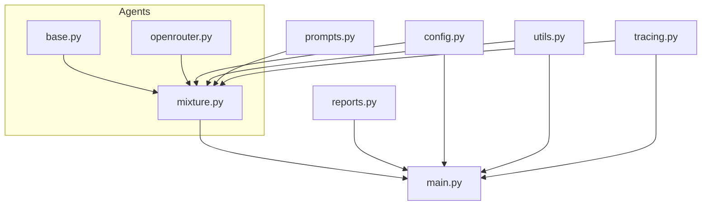

# Modularization-First Refactor Plan

## Overview

This plan outlines a two-phase approach to refactoring the codebase for maintainability and extensibility, in line with the architecture plan. The first phase focuses exclusively on modularization; tracing will be integrated in the second phase after the codebase is cleanly modularized.

---

## Phase 1: Modularization

**Goal:**  
Move all business logic out of the monolithic script and into the appropriate modules, ensuring a clean, decoupled, and maintainable codebase.

### Steps

1. **Module Responsibilities**
   - `config.py`: Configuration and environment variable loading.
   - `utils.py`: Helper functions (file I/O, filename sanitization, markdown escaping, etc.).
   - `agents/`: All agent logic, including base, OpenRouter, and MixtureOfAgents classes.
   - `prompts.py`: All prompt construction logic.
   - `reports.py`: All report generation functions.
   - `main.py`: Orchestration only (no business logic).

2. **Refactor for Decoupling**
   - Remove any business logic from `main.py` that belongs in modules.
   - Ensure all agent logic is in `agents/`.
   - Ensure prompt/report logic is not duplicated and is only in their respective modules.

3. **Consistent Imports and Usage**
   - All modules should import only what they need.
   - No circular dependencies.

4. **Testing**
   - Ensure all modules can be tested independently.
   - Confirm that the main script is clean and only orchestrates the workflow.

---

## Phase 2: Tracing Integration (to be done after modularization)

- Integrate the tracing system as described in the architecture plan.
- Add config toggles, ensure all agent API calls are traced, and output is structured as required.

---

## Mermaid Diagram (Target Structure)

---

**Once modularization is complete and tested, proceed to Phase 2 for tracing integration.**