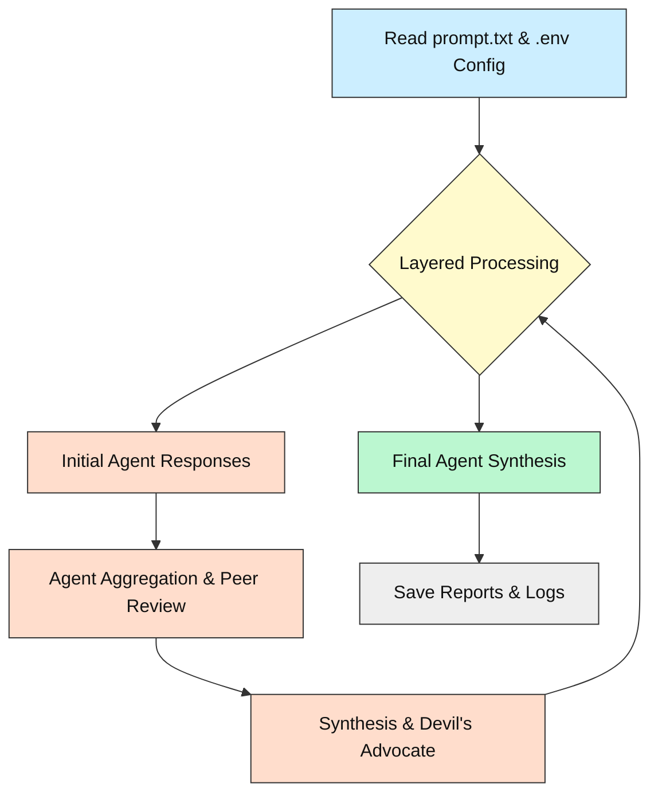
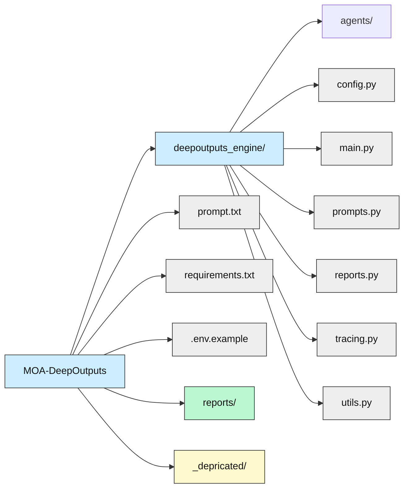
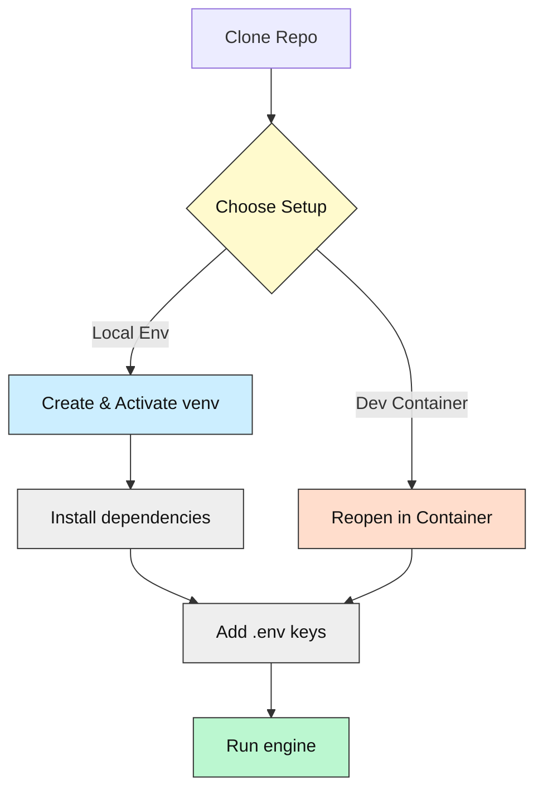

# MOA-DeepOutputs 🚀

[](https://opensource.org/licenses/MIT)


[](https://github.com/codespaces/new?repo=Mindrocket42/MOA-DeepOutputs&machine=basicLinux32gb)

---

## Project Purpose (What & Why)

MOA-DeepOutputs orchestrates multiple LLM agents in a layered "panel discussion" to produce traceable, in-depth analyses ("DeepOutputs") and a concise final answer.

- **Why?** To empower prompt engineers and developers who value transparency, by revealing hypotheses, critiques, and syntheses before concluding.
- **How?** By running a multi-layer agent pipeline, each with distinct roles, and generating detailed Markdown reports for every run.

---

## Tech-Stack Overview

| Component        | Technology                |
| ---------------- | ------------------------ |
| Language         | Python 3.11+             |
| Core Libraries   | httpx, python-dotenv      |
| AI / APIs        | OpenRouter                |
| Concurrency      | asyncio                  |
| Package Manager  | pip                      |

Minimum versions: **Python 3.11+**.

---

## Fork / Improvement Note

This project forks [AI-MickyJ/Mixture-of-Agents](https://github.com/AI-MickyJ/Mixture-of-Agents) with key improvements:

- OpenRouter integration for unified LLM access
- Focus on multi-agent DeepOutput generation
- Removed Docker; uses Python `venv` or `conda`
- Enhanced `.env` config for keys, models, layers
- Improved logging with detailed Markdown reports and tracing

---

## Key Features

- Multi-layer agent pipeline with configurable depth
- Distinct agent roles: initial response, aggregation, synthesis, devil's advocate, finalization
- Swap LLM models per role via `.env` configuration
- Generates detailed Markdown DeepOutput reports for full transparency
- Provides a concise synthesized final answer
- Includes run-specific logs and tracing for debugging and observability

---

## System Overview Diagram (How it works)



---

## Folder / File Guide

```text
📂 MOA-DeepOutputs
├─ deepoutputs_engine/       # Core engine logic and agents
│  ├─ agents/                # Agent implementations
│  ├─ config.py              # Configuration loading
│  ├─ main.py                # Main workflow entrypoint
│  ├─ prompts.py             # Prompt building logic
│  ├─ reports.py             # Report generation
│  ├─ tracing.py             # Workflow tracing
│  └─ utils.py               # Utility functions
├─ prompt.txt                # Input prompt file for the engine
├─ requirements.txt          # Python dependencies
├─ .env.example              # Example environment variables
├─ .gitignore                # Specifies intentionally untracked files
├─ LICENSE                   # Project license
├─ README.md                 # This file
├─ reports/                  # Directory for generated reports and logs
└─ _depricated/              # Archived or deprecated files
```



---

## Prerequisites & Accounts

| Requirement        | Purpose              | Link                               |
| ------------------ | -------------------- | ---------------------------------- |
| Python 3.11+       | Core runtime         | https://www.python.org/downloads/  |
| OpenRouter API key | Access LLMs          | https://openrouter.ai/             |
| Git                | Clone repository     | https://git-scm.com/downloads/     |
| VS Code (Optional) | Dev Container support | https://code.visualstudio.com/     |
| Docker/Podman (Optional) | Dev Container runtime | https://www.docker.com/get-started / https://podman.io/get-started |

---

## Setup Options

### A. Local Virtual Env (recommended for first-timers)

```bash
# Clone the repository
git clone https://github.com/Mindrocket42/MOA-DeepOutputs.git
cd MOA-DeepOutputs

# Create and activate virtual environment
python -m venv .venv
# For Windows PowerShell:
# .\.venv\Scripts\Activate.ps1
# For Linux/macOS:
source .venv/bin/activate

# Install dependencies
pip install -r requirements.txt

# Copy example config and add your OpenRouter API key
# For Linux/macOS:
cp .env.example .env
# For Windows PowerShell:
# copy .env.example .env

# Edit the .env file to add your OPENROUTER_API_KEY

# Run the engine
python deepoutputs_engine/main.py
```

### B. VS Code Dev-Container (zero local installs)

Prerequisites: Docker Engine or Podman, VS Code + Dev Containers extension.

1. Open the `MOA-DeepOutputs` folder in VS Code.
2. When prompted, click **"Reopen in Container"**. If not prompted, open the Command Palette (Ctrl+Shift+P or Cmd+Shift+P) and select **"Dev Containers: Reopen in Container"**.
3. Wait for the container to build and dependencies to install (this may take a few minutes the first time).
4. Once the container is ready, open a new terminal inside VS Code (Terminal > New Terminal).
5. Run the engine:
    ```bash
    python deepoutputs_engine/main.py
    ```
6. Alternatively, press the **Open in Codespace** badge at the top of this README to launch a pre-configured cloud development environment.

---

## Setup Flowchart Diagram



---

## Running / Quick Commands

Ensure your virtual environment is activated or you are in the Dev Container.

```bash
# Run the DeepOutputs engine
python deepoutputs_engine/main.py
```

The engine will read the prompt from `prompt.txt` and generate reports in the `reports/` directory.

---

## Configuration & API Keys 🔑

1. Copy the example environment file:
    - Linux/macOS: `cp .env.example .env`
    - Windows PowerShell: `copy .env.example .env`
2. Edit the newly created `.env` file and set your `OPENROUTER_API_KEY`:
    ```
    OPENROUTER_API_KEY="or-..."
    ```
3. (Optional) Adjust other variables in `.env` to configure the models used for different agent roles and the number of layers in the workflow.

> ⚠️ Do **not** commit your `.env` file to version control. It is included in `.gitignore`. For Codespaces or CI environments, use repository secrets.

---

## Troubleshooting / FAQ

| Symptom                 | Cause                            | Fix                                         |
| ----------------------- | -------------------------------- | ------------------------------------------- |
| `ModuleNotFoundError`   | Virtual env not activated        | `source .venv/bin/activate` (or PowerShell equivalent) |
| VS Code “cannot attach” | Docker daemon off                | Start Docker Desktop / Podman               |
| 401 from OpenRouter     | Missing or invalid API key       | Add valid `OPENROUTER_API_KEY` to `.env`    |
| Empty `reports/` folder | Engine not run or no prompt set  | Run `python deepoutputs_engine/main.py` after setting `prompt.txt` |
| Errors during API calls | Rate limits or model issues      | Check OpenRouter dashboard; try a different model or reduce concurrency in `.env` |

---

## Status & Roadmap

- ✅ Core multi-layer processing engine operational
- ✅ OpenRouter integration via `.env`
- ✅ Configurable agents and layer count
- ✅ Detailed Markdown DeepOutput and log generation
- ✅ Basic tracing of workflow events
- 🔜 Dev Container spec and Docker support
- 🔄 JSON output format for reports coming soon
- ⏳ Enhanced tracing and performance metrics

---

## How AI Helped

ChatGPT assisted in drafting the README structure and refining diagrams.

---

## License & Attribution

This project is licensed under the MIT License - see the [LICENSE](LICENSE) file for details.

---

## Community Support / Feedback

- Open an issue on GitHub for bug reports or feature requests.
- Pull requests are welcome!
- If you're new to coding or this project, tag your issue with `beginner-help` for guidance.

---

*Happy hacking – may your tokens be ever cheaper!* 🎉
