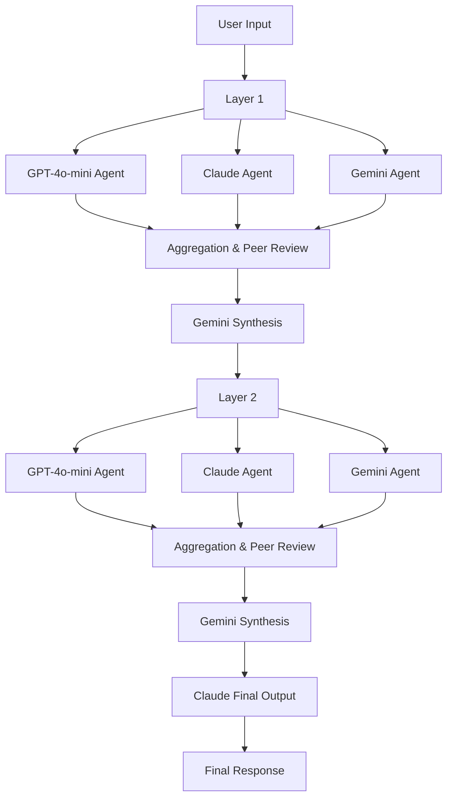

# Single-Router-Mixture of Agents (MoA) Implementation


## Introduction

This is a branch of https://github.com/AI-MickyJ/Mixture-of-Agents

### Changes

1. Routes via OpenRouter for increased model flexibility and choice.
2. Docker dropped in favour of Anaconda/Conda for less experienced users.
3. Changes from the original README are marked in yellow.

#### Benefits
- For novices, Anaconda easier to use than Docker.
- 1 API key.
- 1 API format.
- 1 bill.
- 1 set of routing instructions.
- Simpler & faster integration of new models & providers.

### README 

This project implements a Mixture of Agents (MoA) model, a novel approach to leveraging multiple Large Language Models (LLMs) to enhance reasoning and language generation capabilities. The implementation is based on the paper _"Mixture-of-Agents Enhances Large Language Model Capabilities" by Wang et al. (2024)_. <span style="color: yellow;">It differs in that by using OpenRouter or Groq, MOA can be implemented with both open and closed source models.</span>

## How It Works

<span style="color: yellow;">- The original `moa_model.py` is available and unchanged</span>

<span style="color: yellow;">- `Openrouter_moa_model.py` uses Openrouter and `Groq_moa_model.py` uses Groq</span>

- The MoA implementation utilizes a multi-layer architecture with multiple LLM agents in each layer. The current setup includes:

- Three types of LLM agents:
    - <span style="color: yellow;">GPT-4o-mini</span> (OpenAI)
    - Claude 3.5 Sonnet (Anthropic)
    - Gemini Pro 1.5 (Google)
- Multiple processing layers (configurable, default is 2, maximum recommended is 3)
- Specialized roles for synthesis and final output generation

## Architecture Diagram



## Process Flow:

1. The user input is fed into the first layer.
2. In each layer:
   - All agents process the input simultaneously.
   - Each agent then reviews and aggregates all responses, including their own, with enhanced critical analysis.
   - Gemini synthesizes the aggregated responses and provides a devil's advocate perspective.
3. The synthesized output becomes the input for the next layer.
4. This process repeats through all layers.
5. Claude generates the final output based on all layer syntheses, performing a thorough cross-check against the original prompt.

## New Features

1. **Enhanced Aggregation**: Each agent now performs a more rigorous analysis, including assumption challenging, mathematical verification, and peer review.
2. **Devil's Advocate**: The synthesis step now includes an aggressive devil's advocate perspective to challenge prevailing answers.
3. **Logic Tree Exploration**: Agents are instructed to explore multiple interpretations using logic trees.
4. **Final Cross-Check**: The final output generation includes a thorough cross-check against the original prompt.
5. **Detailed Markdown Logging**: The system now generates comprehensive markdown logs of the entire process.

## Key Differences from the Original Paper

1. **Specialized Roles**: We use Gemini specifically for synthesis and Claude for final output, leveraging their unique strengths.
2. **Enhanced Critical Analysis**: Our implementation includes more rigorous peer review and assumption challenging at each stage.
3. **Devil's Advocate Perspective**: We've added a dedicated step to critically challenge the prevailing answers.
4. **Flexible Layer Configuration**: Users can choose the number of layers, with recommendations for optimal performance.
5. **Comprehensive Logging**: Our system provides detailed, structured logs of the entire reasoning process.

## Features

**Color-Coded CLI Output**
The CLI displays color-coded outputs for each stage of the process, enhancing readability and understanding of the workflow.

**Full Text Display**
The CLI shows the full text of each agent's response at each layer, providing a comprehensive view of the reasoning process.

**Markdown Report Generation**
After each interaction, a detailed Markdown report is generated, containing:
- The original prompt
- Full responses from each agent at each layer
- Synthesis and devil's advocate perspectives
- The final response

This report is useful for in-depth analysis of the MoA process and for sharing results.

## Windows Installation

#:Linux and MacOS users, sorry but you are on your own

<span style="color: yellow;">Suggestion:
- Use Anaconda to create and activate a Python 3.11 virtual environment.
- or use whichever method works for you (Conda, Anaconda, Pycharm).
- conda users can use 'environment.yml'</span>


<span style="color: yellow;">
Follow these steps to set up the project:

1. Clone the repository:
```python
git clone https://github.com/Mindrocket42/OpenRouter-Mixture-of-Agents
```
or 

then 
```python
cd OpenRouter-Mixture-of-Agents
```

3. Create a `.env` file in the project root directory with your API keys (note, the quotation marks are required):
```markdown
OPENAI_API_KEY="your_openai_api_key"
GROQ_API_KEY="your_groq_api_key"
```

## Installation
From the active virtual environment 

```python
pip install -r requirements.txt
```

To run the MoA model:
```Python
python Openrouter_moa_model.py
```

This will start an interactive session where you can enter a prompt and receive a response from the MoA model.

## Output

After during interaction, you will see:

1. Reporting on progress and HTTP codes.
2. A final synthesized response in the CLI.
3. An Agent utilization report.
4. You will be asked if you wish to save the outputs.
    - if yes, Markdown files will be saved in the 'reports' subfolder.

## Project Structure

- `moa_model.py`: The *original*  main implementation of the Mixture of Agents model.
- `environment.yml`: Conda environment specification.
- `requirements.txt`: List of Python package dependencies.
- `.env`: (You need to create this) Contains your API keys.
- `README.md`: This file, containing project information and instructions.
- <span style="color: yellow;">`Openrouter_moa_model.py` and `Groq_moa_model.py` to route via Openrouter or Groq as required.</span>

## Extending the Model
The current implementation provides a basic structure for the MoA model. You can extend it by:

1. Adding more diverse LLM agents.
2. Implementing more sophisticated routing based on task type or model strengths.
3. Experimenting with different aggregation methods.
4. Adjusting the number of layers or layer compositions and prompts.
5. Implementing error handling and rate limiting for API calls.
6. Optimizing performance with more advanced parallel processing techniques.

## References
1. https://github.com/AI-MickyJ/Mixture-of-Agents
2. Wang, J., Wang, J., Athiwaratkun, B., Zhang, C., & Zou, J. (2024). Mixture-of-Agents Enhances Large Language Model Capabilities. arXiv preprint arXiv:2406.04692v1.