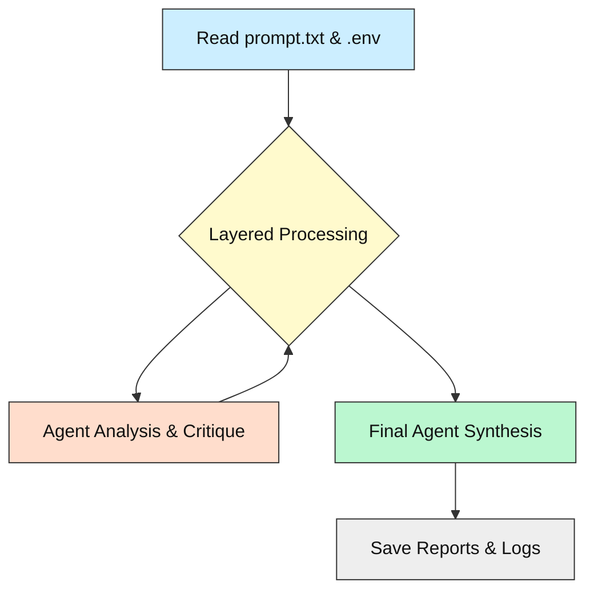
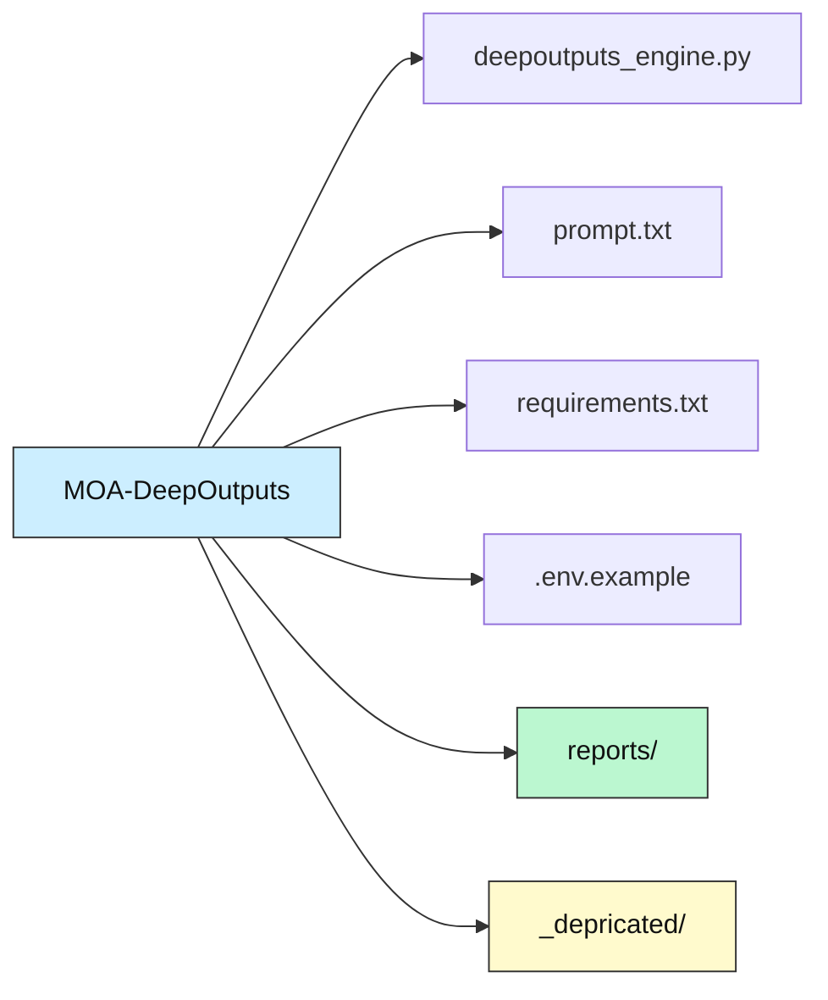
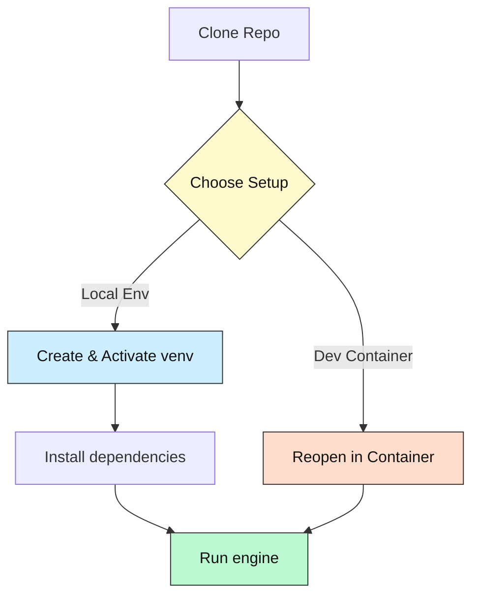

# MOA-DeepOutputs 🚀

[](https://opensource.org/licenses/MIT)


[](https://github.com/codespaces/new?repo=Mindrocket42/MOA-DeepOutputs&machine=basicLinux32gb)

---

## 1· What & Why

MOA-DeepOutputs orchestrates multiple LLM agents in a layered "panel discussion" to produce traceable, in-depth analyses ("DeepOutputs") and a concise final answer.

- **Why?** To empower prompt engineers and developers who value transparency, by revealing hypotheses, critiques, and syntheses before concluding.
- **How?** By running a multi-layer agent pipeline, each with distinct roles, and generating detailed Markdown reports for every run.

---

## 2· Tech-Stack Overview

| Component        | Technology                |
| ---------------- | ------------------------ |
| Language         | Python 3.11+             |
| Core Libraries   | httpx, python-dotenv      |
| AI / APIs        | OpenRouter                |
| Concurrency      | asyncio                  |
| Package Manager  | pip                      |

---

## 3· Fork / Improvement Note

This project forks [AI-MickyJ/Mixture-of-Agents](https://github.com/AI-MickyJ/Mixture-of-Agents) with:

- OpenRouter integration for unified LLM access
- Focus on multi-agent DeepOutput generation
- Removed Docker; uses Python `venv` or `conda`
- Enhanced `.env` config for keys, models, layers
- Improved logging with Markdown reports

---

## 4· Key Features

- Multi-layer agent pipeline, configurable depth
- Distinct roles: response, critique, synthesis, challenge, finalization
- Swap LLM models per role via `.env`
- Generates detailed Markdown DeepOutput reports
- Concise synthesized answer output
- Run-specific logs for debugging and observability

---

## 5· System Overview Diagram



---

## 6· Folder / File Guide

```text
📂 MOA-DeepOutputs
├─ deepoutputs_engine.py       # Main entrypoint
├─ prompt.txt                  # Input prompt file
├─ requirements.txt            # Python dependencies
├─ .env.example                # Example environment variables
├─ .gitignore
├─ LICENSE
├─ README.md
├─ reports/                    # Generated reports and logs
└─ _depricated/                # Archived code
```



---

## 7· Prerequisites & Accounts

| Requirement        | Purpose              | Link                               |
| ------------------ | -------------------- | ---------------------------------- |
| Python 3.11+       | Core runtime         | https://www.python.org/downloads/  |
| OpenRouter API key | Access LLMs          | https://openrouter.ai/             |
| Git                | Clone repository     | https://git-scm.com/downloads/     |

---

## 8· Setup Options

### A. Local Virtual Env (recommended for first-timers)

```bash
git clone https://github.com/Mindrocket42/MOA-DeepOutputs.git
cd MOA-DeepOutputs

# Create and activate virtual environment
python -m venv .venv
# Windows PowerShell:
.\.venv\Scripts\Activate.ps1
# Linux/macOS:
source .venv/bin/activate

# Install dependencies
pip install -r requirements.txt

# Copy example config and add API key
# Linux/macOS:
cp .env.example .env
# Windows PowerShell:
copy .env.example .env

# Run engine
python deepoutputs_engine.py
```

### B. Dev-Container (no local installs, Codespace badge)

Prereqs: Docker Engine or Podman, VS Code + Dev Containers extension.

1. Open the folder in VS Code.
2. Command Palette → "Dev Containers: Reopen in Container".
3. Wait for build and dependency install.
4. In container, run:
    ```bash
    python deepoutputs_engine.py
    ```
5. Or press the **Open in Codespace** badge to launch in cloud.

---

## 9· Setup Flowchart Diagram



---

## 10· Running / Quick Commands

```bash
# Run DeepOutputs engine
python deepoutputs_engine.py
```

---

## 11· Configuration & API Keys 🔑

1. Copy `.env.example` → `.env`.
2. Set your OpenRouter API key:
    ```
    OPENROUTER_API_KEY="or-..."
    ```
3. (Optional) Adjust model and layer variables in `.env`.

> ⚠️ Do **not** commit `.env`. Use repo secrets for Codespaces or CI.

---

## 12· Troubleshooting / FAQ

| Symptom                 | Cause                            | Fix                                         |
| ----------------------- | -------------------------------- | ------------------------------------------- |
| `ModuleNotFoundError`   | Virtual env not activated        | `source .venv/bin/activate`                 |
| VS Code “cannot attach” | Docker daemon off                | Start Docker Desktop / Podman               |
| 401 from OpenRouter     | Missing or invalid API key       | Add valid `OPENROUTER_API_KEY` to `.env`    |
| Empty `reports/` folder | Engine not run or no prompt set  | Run `python deepoutputs_engine.py` first    |

---

## 13· Status & Roadmap

- ✅ Core multi-layer processing engine operational
- ✅ OpenRouter integration via `.env`
- ✅ Configurable agents and layer count
- ✅ Markdown DeepOutput and log generation
- 🔜 Dev Container spec and Docker support
- 🔄 JSON output format coming soon

---

## 14· How AI Helped

ChatGPT assisted in drafting the README structure and refining diagrams.

---

## 15· License & Attribution

MIT – see [LICENSE](LICENSE).

---

## 16· Community Support / Feedback

- Open an issue for bugs or feature requests
- Pull requests welcome
- Tag beginner questions with `beginner-help` for support

---

*Happy hacking – may your tokens be ever cheaper!* 🎉
