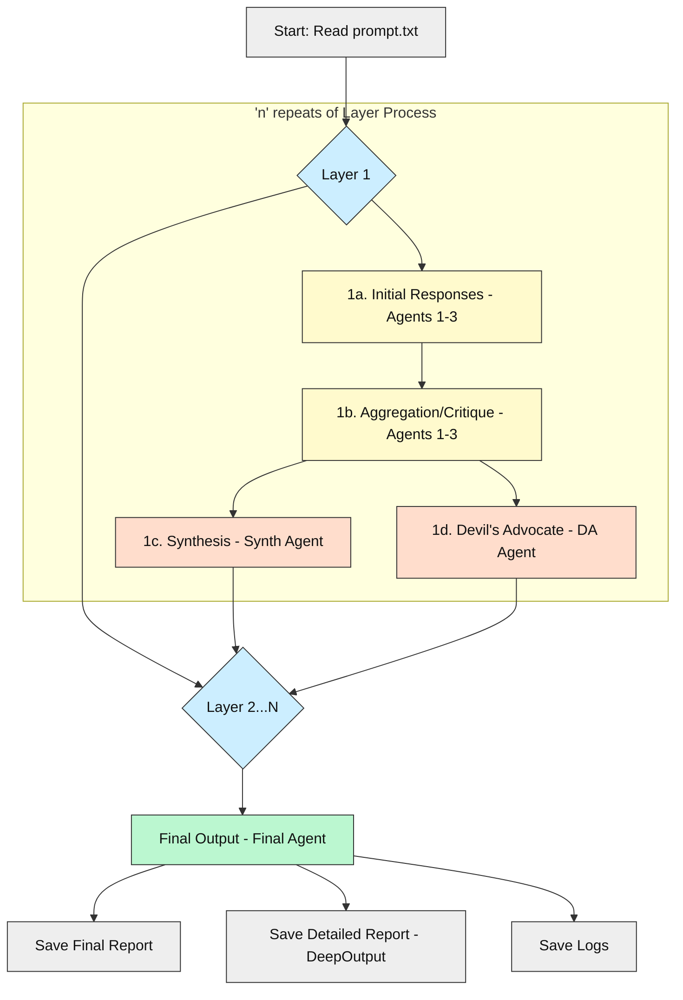
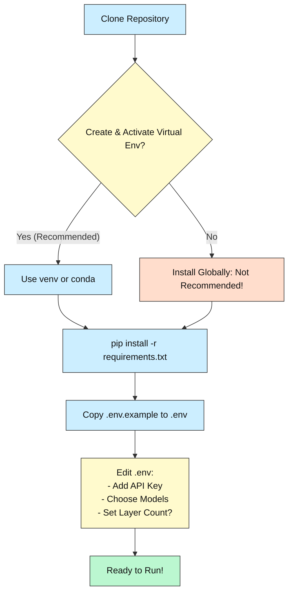

[](https://opensource.org/licenses/MIT)


  

# MOA-DeepOutputs: Multi-Agent Deep Output Generation

  

_An evolution of the Mixture-of-Agents concept, focusing on generating expansive, multi-round analyses before producing a final concise output._

  

---

  

## What is MOA-DeepOutputs?

  

This project leverages a configurable team of Large Language Model (LLM) agents working through multiple layers of analysis and critique to generate in-depth outputs ("DeepOutputs") alongside a concise final answer.

  

Originally inspired by the cost-saving potential of using smaller models in a Mixture-of-Agents (MoA) setup (as described in Wang et al., 2024 and the original [AI-MickyJ/Mixture-of-Agents](https://github.com/AI-MickyJ/Mixture-of-Agents) fork), the focus has shifted. Due to rapid LLM evolution, this implementation now prioritizes **generating a rich, traceable, multi-perspective analysis** using cost-effective agents before synthesizing a final result.

  

Think of it as an automated panel discussion or brainstorming session where different AI viewpoints challenge and build upon each other before a final conclusion is drawn.

  

**Who is it for?** Users who want more than just a final answer – those who value seeing the underlying reasoning, debates, and alternative perspectives explored by multiple AI agents.

  

---

  

## Tech Stack 

  

| Area         | Technologies                                       |
|--------------|----------------------------------------------------|
| **Language** | Python (3.11+)                                     |
| **Core Libs**| `httpx` (async HTTP), `python-dotenv` (config)     |
| **AI/APIs**   | OpenRouter (for access to various LLMs)            |
| **Tooling**   | `pip` (package management), `asyncio` (concurrency)|

  

---

  

## Fork Information

  

This project originated as a fork of [AI-MickyJ/Mixture-of-Agents](https://github.com/AI-MickyJ/Mixture-of-Agents). Key changes include:

- **OpenRouter Integration:** Uses OpenRouter, allowing access to a wide variety of LLMs with a single API key and format.

- **Focus Shift:** Moved from replicating SOTA model outputs cheaply to generating "DeepOutputs" – detailed multi-agent discussions.

- **Simplified Setup:** Removed Docker dependency, focusing on Python virtual environments (`venv` or `conda`).

- **Enhanced Configuration:** Uses `.env` file for easy configuration of API keys, models, and report identifiers.

- **Improved Logging & Reporting:** Generates detailed logs and structured Markdown reports for observability.

  

---

  

## Key Features 

  

- **Multi-Layer Processing:** Input prompts are processed through a configurable number of analytical layers.

- **Specialized Agent Roles:** Uses distinct agents for initial response, aggregation/critique, synthesis, devil's advocacy, and final output generation.

- **Configurable Models:** Easily swap LLMs for each role via environment variables in the `.env` file, leveraging OpenRouter's catalog.

- **Deep Output Generation:** Produces detailed Markdown reports showing the full multi-agent discussion, synthesis, and critiques from each layer.

- **Concise Final Answer:** Provides a final, synthesized answer generated after the multi-layer process.

- **Observability:** Generates run-specific log files for debugging and tracing the process.

- **Environment Variable Configuration:** API keys, models, number of layers, and OpenRouter reporting identifiers are set in `.env`.

  

```
.
├── .env                # Your API keys, model choices, reporting IDs (Create this!)
├── .env.example        # Example environment file
├── .gitignore
├── deepoutputs_engine.py # The main script to run the process
├── prompt.txt           # Input prompt file
├── README.md           # This file
├── requirements.txt      # Python dependencies
└── reports/             # Output directory for reports and logs (created automatically)
    └── <run_name>/ 
       ├── <run_name>_final_report_TIMESTAMP.md
       ├── <run_name>_detailed_report_TIMESTAMP.md
       └── <run_name>_logs_TIMESTAMP.log
```

  

---

  

## How It Works: System Overview

  

The system processes a prompt from `prompt.txt` through a sequence of layers:

  

1.  **Input:** The initial prompt is read from `prompt.txt`.

2.  **Layer Processing (Repeated `N` times):**

    a.  **Initial Response:** Multiple base agents generate independent responses to the current context (initial prompt or previous layer's synthesis/critique).

    b.  **Aggregation & Peer Review:** The same base agents review *all* initial responses from step (a), critiquing them and providing an improved, independent answer.

    c.  **Synthesis:** A dedicated Synthesis Agent summarizes the aggregated responses, identifying key insights and agreements/disagreements.

    d.  **Devil's Advocate:** A dedicated Devil's Advocate Agent critiques the aggregated responses, challenging assumptions and consensus views.

    e.  **Context Carry-over:** The Synthesis and Devil's Advocate outputs become additional context for the *next* layer.

3.  **Final Output:** A dedicated Final Agent reviews the original prompt and the synthesis/critique from *all* layers to generate the final, concise answer.

4.  **Reporting:** Three key outputs are saved:

    *   `_final_report.md`: Contains the original prompt, agent utilization heuristics, and the concise final response.

    *   `_detailed_report.md`: Contains everything from the final report *plus* the full "DeepOutput" - all initial responses, aggregations, syntheses, and critiques from every layer, structured for review.

    *   `_logs.log`: Detailed execution logs for observability and debugging.

  

### Process Flow Diagram

  



  

---

  

## Prerequisites 

  

- **Python 3.11+:** Ensure you have a working Python 3.11 or newer installation. [Download Python](https://www.python.org/downloads/)

- **Package Manager:** `pip` (usually included with Python).

- **OpenRouter API Key:** You need an API key from [OpenRouter.ai](https://openrouter.ai/) to access the LLMs.

- **Virtual Environment (Recommended):** Tools like `venv` (built-in) or `conda` / `anaconda` help manage project dependencies cleanly.

  

---

  

## Setup Guide (Virtual Environment Recommended)

  

We recommend using a virtual environment to avoid conflicts with other Python projects.

  

1.  **Clone the Repository:**

```bash
    git clone https://github.com/Mindrocket42/MOA-DeepOutputs.git

    cd MOA-DeepOutputs

 ```

  

2.  **Create and Activate Virtual Environment:**

    *   **Using `venv` (Standard Python):**

```bash

       # Create environment (use python3 or python depending on your system)

       python -m venv venv

       # Activate (Windows PowerShell)

       .\venv\Scripts\Activate.ps1

       # Activate (Linux/macOS Bash)

       # source venv/bin/activate

```

    *   **Using `conda`:**

```bash

       # Create environment

       conda create --name moa-deepoutputs python=3.11

       # Activate

       conda activate moa-deepoutputs

```

  

3.  **Install Dependencies:**

    (Ensure your virtual environment is active)

```bash

    pip install -r requirements.txt

```

  

4.  **Configure Environment Variables:**

    *   Copy the example file:

```bash

       # Windows

       copy .env.example .env

       # Linux/macOS

       # cp .env.example .env

```

    *   **Edit the `.env` file** with a text editor:

       *   Add your `OPENROUTER_API_KEY`.

       *   Customize `AGENT*_MODEL`, `SYNTHESIS_AGENT_MODEL`, `DEVILS_ADVOCATE_AGENT_MODEL`, `FINAL_AGENT_MODEL` with desired OpenRouter model IDs (defaults are provided).

       *   Adjust `MOA_NUM_LAYERS` if needed (default is 2).

       *   The `HTTP_REFERER` and `X_TITLE` are used to identify your app in OpenRouter logs; you can keep the defaults or customize them.

    *   **Important Security Note:** Ensure the `.env` file is added to your `.gitignore` file and **never commit it to version control**, as it contains your secret API key.


---
  

### Visual Setup Guide 

  


  

---

  

## Running the Project 

  

1.  **Edit `prompt.txt`:** Open the `prompt.txt` file in the root directory and replace its contents with the prompt you want the agents to process.

2.  **Run the Engine:** (Make sure your virtual environment is activated and you are in the project's root directory)

```bash

    python deepoutputs_engine.py

```

3.  **Check Output:** The script will print progress to the console. Once finished, it will show the location of the generated reports and logs within the `reports/` directory.

  

---

  

## Troubleshooting 

  

- **AuthenticationError / Invalid API Key:** Double-check that your `OPENROUTER_API_KEY` in the `.env` file is correct and active. Ensure the `.env` file is in the project's root directory and is being loaded correctly (no typos in the filename).
- **Model Not Found:** Verify that the model identifiers specified in your `.env` file are valid OpenRouter models listed [here](https://openrouter.ai/docs#models). Some models might be deprecated or require specific access.
- **Python Version Error:** Make sure you are running the script with Python 3.11 or newer. Check your version with `python --version` or `python3 --version`.
- **Dependency Issues:** If you encounter `ModuleNotFoundError`, ensure you have activated your virtual environment (if using one) and have installed the required packages using `pip install -r requirements.txt`.


---


## Status & Roadmap 

  
-   Core multi-layer processing engine operational.

-   OpenRouter integration for flexible model selection.

-   Configurable agents, layers, and reporting IDs via `.env`.

-   Generation of final, detailed (DeepOutput), and log files.

-   Ongoing prompt engineering refinements for agent roles.

-   Exploration of different agent configurations and interaction patterns.

-   Potential addition of more structured output formats (e.g., JSON).


---


## License 

  
This project is licensed under the MIT License. See the [LICENSE](https://opensource.org/licenses/MIT) file (implied, standard MIT license text applies).

  
---
  

## Contribute & Connect 


- Found a bug or have an idea? Please [open an issue](https://github.com/Mindrocket42/MOA-DeepOutputs/issues).

- Contributions via Pull Requests are welcome!

- Feedback is appreciated, especially regarding the usefulness of the "DeepOutput" format.

  
---
  

_Generating deeper insights through collaborative AI discussion._
