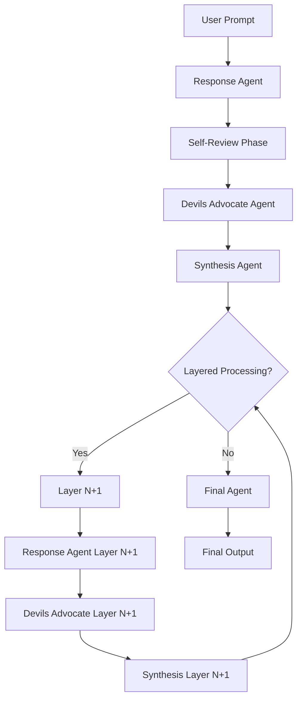

# Single Agent Workflow Architecture Plan

## Overview

This document outlines the complete architecture for implementing a single agent workflow system based on the existing MOA (Mixture of Agents) patterns. The system maintains the cognitive rigor of MOA while using specialized models for different thinking functions.

## Improved Workflow Design

### Architecture Pattern: Specialized Cognitive Functions



### Workflow Steps

1. **Initial Response Phase** (Response Agent)
   - Process user prompt with deep analysis
   - Generate comprehensive initial response
   - Include assumptions and confidence levels

2. **Self-Review Phase** (Response Agent with review prompt)
   - Critical self-assessment of initial response
   - Identify potential weaknesses or gaps
   - Suggest improvements or alternatives

3. **Devils Advocate Challenge** (Devils Advocate Agent)
   - Aggressive stress-testing of the response
   - Challenge core assumptions
   - Identify blind spots and edge cases
   - Provide contrarian viewpoints

4. **Synthesis & Integration** (Synthesis Agent)
   - Integrate insights from all previous phases
   - Manage dissent and surface key critiques
   - Create unified narrative with dissenting viewpoints
   - Outline next steps or unanswered questions

5. **Layered Processing** (Optional, configurable layers)
   - Repeat steps 1-4 for complex problems
   - Each layer builds on previous synthesis
   - Maintains context and dissent throughout

6. **Final Agent Synthesis** (Final Agent)
   - Authoritative final decision
   - Reference all layer context
   - Surface dissenting viewpoints
   - Provide residual uncertainty assessment

## Directory Structure

```
./single_agent/
├── single_agent_engine/
│   ├── __init__.py
│   ├── config.py
│   ├── main.py
│   ├── agents/
│   │   ├── __init__.py
│   │   ├── base.py
│   │   ├── single_agent.py
│   │   └── openrouter.py
│   ├── workflow.py
│   ├── prompts.py
│   ├── tracing.py
│   ├── reports.py
│   └── utils.py
├── reports/
├── traces/
├── prompts/
├── dry_runs/
│   ├── reports/
│   └── traces/
└── .env_single_agent
```

## Environment Variables

### Single Agent Models
```env
# Single Agent Workflow Models
SA_RESPONSE_AGENT_MODEL="anthropic/claude-3.5-sonnet"
SA_DEVILS_ADVOCATE_AGENT_MODEL="openai/gpt-4o"
SA_SYNTHESIS_AGENT_MODEL="google/gemini-2.0-flash-001"
SA_FINAL_AGENT_MODEL="anthropic/claude-3.5-haiku"

# Single Agent Configuration
SA_NUM_LAYERS=2
SA_ENABLE_SELF_REVIEW=true
SA_OUTPUT_DIR="single_agent/reports"
SA_TRACE_DIR="single_agent/traces"

# Token Limits
SA_RESPONSE_MAX_TOKENS=8000
SA_REVIEW_MAX_TOKENS=4000
SA_DEVILS_ADVOCATE_MAX_TOKENS=6000
SA_SYNTHESIS_MAX_TOKENS=8000
SA_FINAL_MAX_TOKENS=6000
```

## Core Components

### 1. SingleAgent Base Class
- Inherits from existing Agent base class
- Specialized for single-agent cognitive functions
- Supports role-specific prompting

### 2. SingleAgentWorkflow Orchestrator
- Manages the complete workflow execution
- Handles layer processing and context management
- Integrates tracing and performance metrics

### 3. Single Agent Prompts
- Response agent prompts (initial + self-review)
- Devils advocate prompts (aggressive challenge)
- Synthesis prompts (integration + dissent management)
- Final agent prompts (authoritative decision)

### 4. Tracing & Reporting
- Adapted from MOA tracing system
- Tracks cognitive function transitions
- Measures model utilization and performance
- Generates detailed workflow reports

## Key Features

### Cognitive Function Specialization
- **Response Agent**: Deep analysis, reasoning, assumption identification
- **Devils Advocate**: Critical challenge, contrarian thinking, stress-testing
- **Synthesis Agent**: Integration, dissent management, narrative building
- **Final Agent**: Authoritative decision, uncertainty assessment

### Context Management
- Maintains full context across all phases
- Preserves dissenting viewpoints throughout
- Tracks assumption evolution and confidence changes

### Layered Processing
- Configurable number of processing layers
- Each layer refines and deepens analysis
- Context accumulation across layers

### Quality Assurance
- Self-review mechanisms
- Aggressive challenge phases
- Dissent preservation and surfacing
- Confidence and uncertainty tracking

## Implementation Strategy

### Phase 1: Core Infrastructure
1. Create directory structure
2. Set up environment variables
3. Implement base classes and configuration

### Phase 2: Workflow Engine
1. Implement SingleAgentWorkflow orchestrator
2. Create specialized prompt templates
3. Integrate tracing and logging

### Phase 3: Reporting & Testing
1. Adapt reporting system for single agent
2. Create test scenarios and validation
3. Performance optimization and tuning

### Phase 4: Documentation & Examples
1. Create usage documentation
2. Provide example workflows
3. Performance benchmarking

## Benefits Over Original Proposal

1. **Maintains MOA Quality**: Preserves the rigorous analysis patterns
2. **Specialized Thinking**: Each model optimized for specific cognitive functions
3. **Dissent Management**: Ensures critical viewpoints are preserved and surfaced
4. **Layered Depth**: Supports complex problem decomposition
5. **Full Observability**: Complete tracing and performance metrics
6. **Flexible Configuration**: Adaptable to different problem types

## Next Steps

1. Switch to Code mode for implementation
2. Create the directory structure and core files
3. Implement the workflow orchestrator
4. Test with sample prompts
5. Generate comprehensive documentation

This architecture provides a robust foundation for single agent workflows while maintaining the analytical rigor and quality assurance mechanisms that make MOA effective.